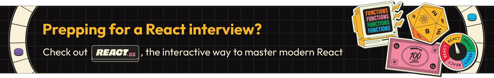

This page will be the home page when users visit https://example.com/.

# React Interview Questions & Answers

> Click :star:if you like the project. Pull Request are highly appreciated. Follow me [@SudheerJonna](https://twitter.com/SudheerJonna) for technical updates.

---

---

**Note:** This repository is specific to ReactJS. Please check [Javascript Interview questions](https://github.com/sudheerj/javascript-interview-questions) for core javascript questions.

### Table of Contents

| No. | Questions

| 1 | [What is React?](#what-is-react) |

| 2 | [What are the major features of React?](#what-are-the-major-features-of-react) |

| 3 | [What is JSX?](#what-is-jsx) |

| 4 | [What is the difference between Element and Component?](#what-is-the-difference-between-element-and-component) |

| 5 | [How to create components in React?](#how-to-create-components-in-react) |

| 6 | [When to use a Class Component over a Function Component?](#when-to-use-a-class-component-over-a-function-component) |

| 7 | [What are Pure Components?](#what-are-pure-components) |

| 8 | [What is state in React?](#what-is-state-in-react) |

| 9 | [What are props in React?](#what-are-props-in-react) |

| 10 | [What is the difference between state and props?](#what-is-the-difference-between-state-and-props) |

| 11 | [Why should we not update the state directly?](#why-should-we-not-update-the-state-directly) |

| 12 | [What is the purpose of callback function as an argument of setState()?](#what-is-the-purpose-of-callback-function-as-an-argument-of-setstate) |

| 13 | [What is the difference between HTML and React event handling?](#what-is-the-difference-between-html-and-react-event-handling) |

| 14 | [How to bind methods or event handlers in JSX callbacks?](#how-to-bind-methods-or-event-handlers-in-jsx-callbacks) |

| 15 | [How to pass a parameter to an event handler or callback?](#how-to-pass-a-parameter-to-an-event-handler-or-callback) |

| 16 | [What are synthetic events in React?](#what-are-synthetic-events-in-react) |

| 17 | [What are inline conditional expressions?](#what-are-inline-conditional-expressions) |

| 18 | [What is "key" prop and what is the benefit of using it in arrays of elements?](#what-is-key-prop-and-what-is-the-benefit-of-using-it-in-arrays-of-elements) |

| 19 | [What is the use of refs?](#what-is-the-use-of-refs) |

| 20 | [How to create refs?](#how-to-create-refs) |

| 21 | [What are forward refs?](#what-are-forward-refs) |

| 22 | [Which is preferred option with in callback refs and findDOMNode()?](#which-is-preferred-option-with-in-callback-refs-and-finddomnode) |

| 23 | [Why are String Refs legacy?](#why-are-string-refs-legacy) |

| 24 | [What is Virtual DOM?](#what-is-virtual-dom) |

| 25 | [How Virtual DOM works?](#how-virtual-dom-works) |

| 26 | [What is the difference between Shadow DOM and Virtual DOM?](#what-is-the-difference-between-shadow-dom-and-virtual-dom) |

| 27 | [What is React Fiber?](#what-is-react-fiber) |

| 28 | [What is the main goal of React Fiber?](#what-is-the-main-goal-of-react-fiber) |

| 29 | [What are controlled components?](#what-are-controlled-components) |

| 30 | [What are uncontrolled components?](#what-are-uncontrolled-components) |

| 31 | [What is the difference between createElement and cloneElement?](#what-is-the-difference-between-createelement-and-cloneelement) |

| 32 | [What is Lifting State Up in React?](#what-is-lifting-state-up-in-react) |

| 33 | [What are the different phases of component lifecycle?](#what-are-the-different-phases-of-component-lifecycle) |

| 34 | [What are the lifecycle methods of React?](#what-are-the-lifecycle-methods-of-react) |

| 35 | [What are Higher-Order components?](#what-are-higher-order-components) |

| 36 | [How to create props proxy for HOC component?](#how-to-create-props-proxy-for-hoc-component) |

| 37 | [What is context?](#what-is-context) |

| 38 | [What is children prop?](#what-is-children-prop) |

| 39 | [How to write comments in React?](#how-to-write-comments-in-react) |

| 40 | [What is the purpose of using super constructor with props argument?](#what-is-the-purpose-of-using-super-constructor-with-props-argument) |

| 41 | [What is reconciliation?](#what-is-reconciliation) |

| 42 | [How to set state with a dynamic key name?](#how-to-set-state-with-a-dynamic-key-name) |
| 43 | [What would be the common mistake of function being called every time the component renders?](#what-would-be-the-common-mistake-of-function-being-called-every-time-the-component-renders) |

| 44 | [Is lazy function supports named exports?](#is-lazy-function-supports-named-exports) |

| 45 | [Why React uses className over class attribute?](#why-react-uses-classname-over-class-attribute) |

| 46 | [What are fragments?](#what-are-fragments) |

| 47 | [Why fragments are better than container divs?](#why-fragments-are-better-than-container-divs) |

| 48 | [What are portals in React?](#what-are-portals-in-react) |

| 49 | [What are stateless components?](#what-are-stateless-components) |

| 50 | [What are stateful components?](#what-are-stateful-components) |

| 51 | [How to apply validation on props in React?](#how-to-apply-validation-on-props-in-react) |

| 52 | [What are the advantages of React?](#what-are-the-advantages-of-react) |

| 53 | [What are the limitations of React?](#what-are-the-limitations-of-react) |

| 54 | [What are error boundaries in React v16](#what-are-error-boundaries-in-react-v16) |

| 55 | [How are error boundaries handled in React v15?](#how-are-error-boundaries-handled-in-react-v15) |

| 56 | [What are the recommended ways for static type checking?](#what-are-the-recommended-ways-for-static-type-checking) |

| 57 | [What is the use of react-dom package?](#what-is-the-use-of-react-dom-package) |

| 58 | [What is the purpose of render method of react-dom?](#what-is-the-purpose-of-render-method-of-react-dom) |
| 59 | [What is ReactDOMServer?](#what-is-reactdomserver) |

| 60 | [How to use InnerHtml in React?](#how-to-use-innerhtml-in-react) |

| 61 | [How to use styles in React?](#how-to-use-styles-in-react) |

| 62 | [How events are different in React?](#how-events-are-different-in-react) |

| 63 | [What will happen if you use setState in constructor?](#what-will-happen-if-you-use-setstate-in-constructor) |

| 64 | [What is the impact of indexes as keys?](#what-is-the-impact-of-indexes-as-keys) |

| 65 | [Is it good to use setState() in componentWillMount() method?](#is-it-good-to-use-setstate-in-componentwillmount-method) |

| 66 | [What will happen if you use props in initial state?](#what-will-happen-if-you-use-props-in-initial-state) |

| 67 | [How do you conditionally render components?](#how-do-you-conditionally-render-components) |

| 68 | [Why we need to be careful when spreading props on DOM elements??](#why-we-need-to-be-careful-when-spreading-props-on-dom-elements) |

| 69 | [How you use decorators in React?](#how-you-use-decorators-in-react) |

| 70 | [How do you memoize a component?](#how-do-you-memoize-a-component) |

| 71 | [How you implement Server-Side Rendering or SSR?](#how-you-implement-server-side-rendering-or-ssr) |

| 72 | [How to enable production mode in React?](#how-to-enable-production-mode-in-react) |

| 73 | [What is CRA and its benefits?](#what-is-cra-and-its-benefits) |

| 74 | [What is the lifecycle methods order in mounting?](#what-is-the-lifecycle-methods-order-in-mounting) |

| 75 | [What are the lifecycle methods going to be deprecated in React v16?](#what-are-the-lifecycle-methods-going-to-be-deprecated-in-react-v16) |

| 76 | [What is the purpose of getDerivedStateFromProps() lifecycle method?](#what-is-the-purpose-of-getderivedstatefromprops-lifecycle-method) |

| 77 | [What is the purpose of getSnapshotBeforeUpdate() lifecycle method?](#what-is-the-purpose-of-getsnapshotbeforeupdate-lifecycle-method) |

| 78 | [Do Hooks replace render props and higher order components?](#do-hooks-replace-render-props-and-higher-order-components) |

| 79 | [What is the recommended way for naming components?](#what-is-the-recommended-way-for-naming-components) |

| 80 | [What is the recommended ordering of methods in component class?](#what-is-the-recommended-ordering-of-methods-in-component-class) |

| 81 | [What is a switching component?](#what-is-a-switching-component) |

| 82 | [Why we need to pass a function to setState()?](#why-we-need-to-pass-a-function-to-setstate) |

| 84 | [What are React Mixins?](#what-are-react-mixins) |

| 85 | [Why is isMounted() an anti-pattern and what is the proper solution?](#why-is-ismounted-an-anti-pattern-and-what-is-the-proper-solution) |

| 86 | [What are the Pointer Events supported in React?](#what-are-the-pointer-events-supported-in-react) |

| 87 | [Why should component names start with capital letter?](#why-should-component-names-start-with-capital-letter) |

| 88 | [Are custom DOM attributes supported in React v16?](#are-custom-dom-attributes-supported-in-react-v16) |

| 89 | [What is the difference between constructor and getInitialState?](#what-is-the-difference-between-constructor-and-getinitialstate) |

| 90 | [Can you force a component to re-render without calling setState?](#can-you-force-a-component-to-re-render-without-calling-setstate) |

| 91 | [What is the difference between super() and super(props) in React using ES6 classes?](#what-is-the-difference-between-super-and-superprops-in-react-using-es6-classes) |

| 92 | [How to loop inside JSX?](#how-to-loop-inside-jsx) |

| 93 | [How do you access props in attribute quotes?](#how-do-you-access-props-in-attribute-quotes) |

| 94 | [What is React PropType array with shape?](#what-is-react-proptype-array-with-shape) |

| 95 | [How to conditionally apply class attributes?](#how-to-conditionally-apply-class-attributes) |

| 96 | [What is the difference between React and ReactDOM?](#what-is-the-difference-between-react-and-reactdom) |

| 97 | [Why ReactDOM is separated from React?](#why-reactdom-is-separated-from-react) |

| 98 | [How to use React label element?](#how-to-use-react-label-element) |

| 99 | [How to combine multiple inline style objects?](#how-to-combine-multiple-inline-style-objects) |
| 100 | [How to re-render the view when the browser is resized?](#how-to-re-render-the-view-when-the-browser-is-resized) |

| 101 | [What is the difference between setState and replaceState methods?](#what-is-the-difference-between-setstate-and-replacestate-methods) |

| 102 | [How to listen to state changes?](#how-to-listen-to-state-changes) |

| 103 | [What is the recommended approach of removing an array element in react state?](#what-is-the-recommended-approach-of-removing-an-array-element-in-react-state) |

| 104 | [Is it possible to use React without rendering HTML?](#is-it-possible-to-use-react-without-rendering-html) |

| 105 | [How to pretty print JSON with React?](#how-to-pretty-print-json-with-react) |

| 106 | [Why you can't update props in React?](#why-you-cant-update-props-in-react) |

| 107 | [How to focus an input element on page load?](#how-to-focus-an-input-element-on-page-load) |

| 108 | [What are the possible ways of updating objects in state?](#what-are-the-possible-ways-of-updating-objects-in-state) |

| 110 | [How can we find the version of React at runtime in the browser?](#how-can-we-find-the-version-of-react-at-runtime-in-the-browser) |

| 111 | [What are the approaches to include polyfills in your create-react-app?](#what-are-the-approaches-to-include-polyfills-in-your-create-react-app) |

| 112 | [How to use https instead of http in create-react-app?](#how-to-use-https-instead-of-http-in-create-react-app) |

| 113 | [How to avoid using relative path imports in create-react-app?](#how-to-avoid-using-relative-path-imports-in-create-react-app) |

| 114 | [How to add Google Analytics for react-router?](#how-to-add-google-analytics-for-react-router) |

| 115 | [How to update a component every second?](#how-to-update-a-component-every-second) |

| 116 | [How do you apply vendor prefixes to inline styles in React?](#how-do-you-apply-vendor-prefixes-to-inline-styles-in-react) |

| 117 | [How to import and export components using react and ES6?](#how-to-import-and-export-components-using-react-and-es6) |

| 118 | [What are the exceptions on React component naming?](#what-are-the-exceptions-on-react-component-naming) |

| 119 | [Why is a component constructor called only once?](#why-is-a-component-constructor-called-only-once) |

| 120 | [How to define constants in React?](#how-to-define-constants-in-react) |

| 121 | [How to programmatically trigger click event in React?](#how-to-programmatically-trigger-click-event-in-react) |

| 122 | [Is it possible to use async/await in plain React?](#is-it-possible-to-use-asyncawait-in-plain-react) |

| 123 | [What are the common folder structures for React?](#what-are-the-common-folder-structures-for-react) |

| 124 | [What are the popular packages for animation?](#what-are-the-popular-packages-for-animation) |

| 125 | [What is the benefit of styles modules?](#what-is-the-benefit-of-styles-modules) |

| 126 | [What are the popular React-specific linters?](#what-are-the-popular-react-specific-linters) |

| 127 | [How to make AJAX call and In which component lifecycle methods should I make an AJAX call?](#how-to-make-ajax-call-and-in-which-component-lifecycle-methods-should-i-make-an-ajax-call) |

| 128 | [What are render props?](#what-are-render-props) |
